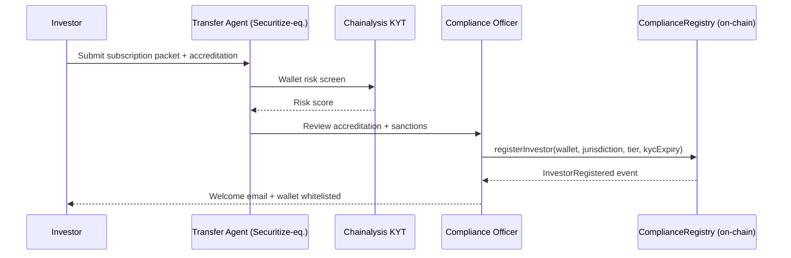
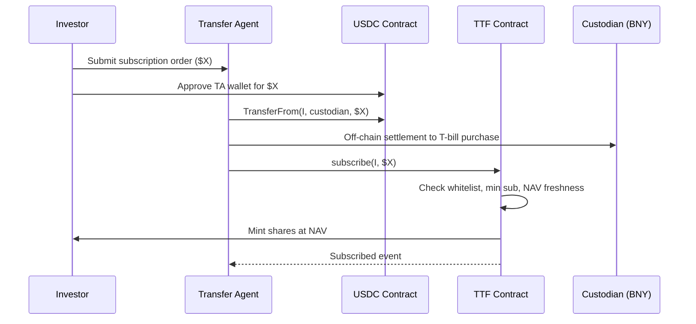
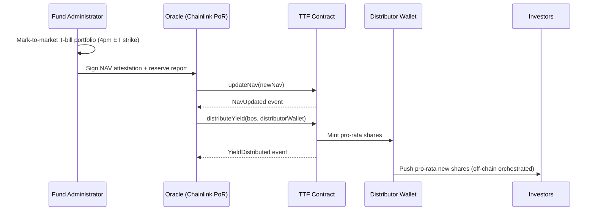
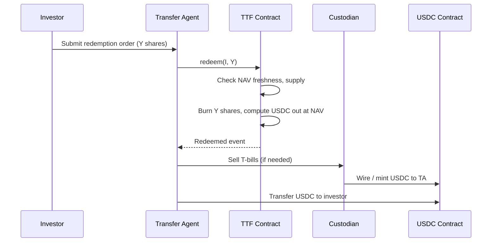
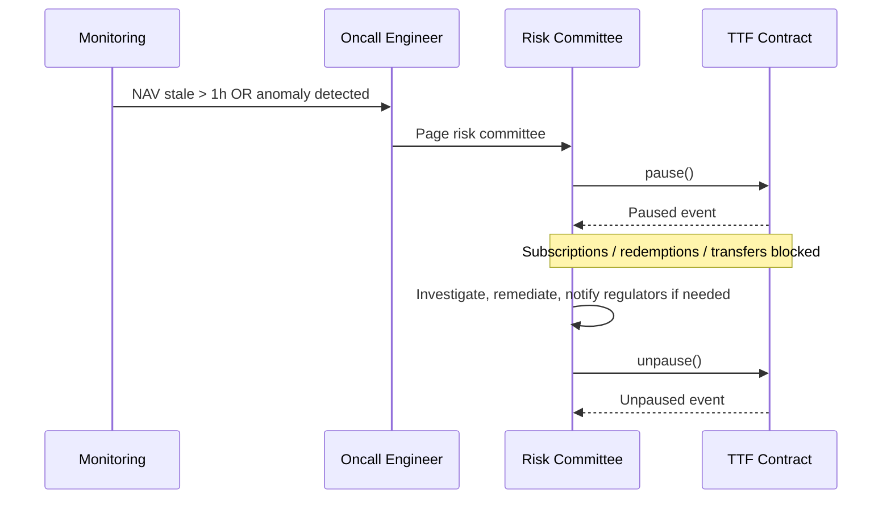
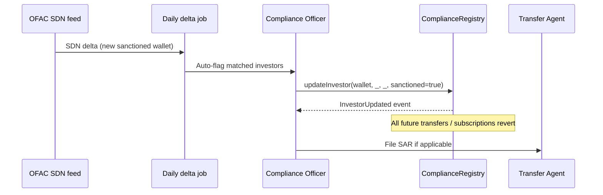

# Process Flows — Tokenized Treasury Fund

Diagrams use [Mermaid](https://mermaid.js.org/) so GitHub renders them inline.

## 1. Investor onboarding (cap-table entry)

## 2. Subscribe (mint)

## 3. Daily NAV + yield distribution

## 4. Redemption (burn)

## 5. Incident response (pause)

## 6. Sanctions hit (in-flight investor)

